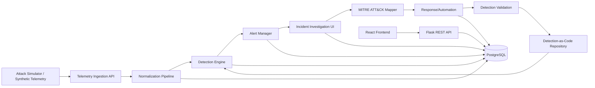
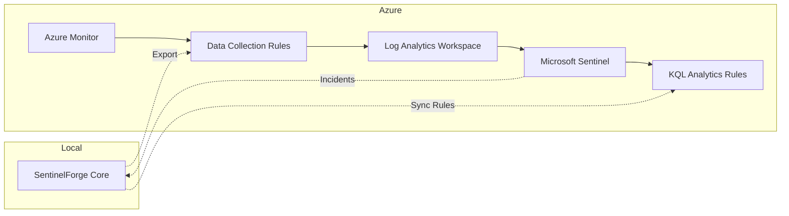

# SentinelForge — Architecture

## 1. Project Overview
SentinelForge is a modular-monolith detection-engineering and security-monitoring platform. It implements the core SIEM workflow: telemetry ingestion → normalization → detection → alerting → investigation → MITRE ATT&CK mapping → response → validation. The system runs entirely locally in demo mode; Azure integration is optional and additive.

## 2. High-Level Architecture



## 3. React Frontend (Vite + TypeScript)
- **Responsibility**: Dashboard, rule authoring, alert triage, incident investigation, ATT&CK visualization, response playbook triggers.
- **Structure**: Feature-based modules (`/features/detection`, `/features/incidents`, `/features/rules`, `/features/attck`).
- **State**: React Query for server state, Zustand for UI state.
- **Communication**: REST calls to Flask API; WebSocket for real-time alerts (future).

## 4. Flask Backend (Python + Flask)
- **Responsibility**: REST API, business logic orchestration, detection evaluation, alert/incident management, audit logging.
- **Structure**: Blueprints per domain (`telemetry`, `detection`, `alerts`, `incidents`, `attck`, `response`, `auth`, `audit`).
- **Extensions**: Flask-SQLAlchemy (ORM), Flask-Migrate (migrations), Flask-JWT-Extended (auth), Flask-Limiter (rate limiting).
- **Configuration**: Environment-based config classes (`Config`, `DevelopmentConfig`, `TestingConfig`, `ProductionConfig`).

## 5. PostgreSQL
- **Role**: Single source of truth for all persistent data.
- **See Also**: Section 11 (Database Architecture) for detailed entity definitions.

## 6. Telemetry Ingestion
- **Entry Point**: `POST /api/v1/telemetry` (batch or single).
- **Sources** (demo): Synthetic generators (Atomic Red Team, custom scripts), local file watchers, Syslog/Winlogbeat forwarders.
- **Normalization**: Pluggable parsers per source type → unified schema (ECS-inspired): `timestamp`, `event_type`, `source`, `host`, `user`, `process`, `network`, `file`, `metadata`.
- **Validation**: JSON schema validation; malformed events quarantined with audit entry.

## 7. Detection Engine
- **Rule Format**: YAML files (Detection-as-Code) with fields: `id`, `name`, `description`, `severity`, `enabled`, `version`, `author`, `tags`, `attck_techniques[]`, `query` (SQL/Elastic DSL-like), `test_cases[]`.
- **Execution**: On each normalized event, evaluate enabled rules. In-memory rule cache refreshed on file change or API reload.
- **Output**: Match → create `detection_execution` + `alert`; no-match → `detection_execution` only.
- **Performance**: Rule indexing by event_type; async evaluation via thread pool.

## 8. Alert & Incident Flow
1. **Alert Created** → severity, rule reference, triggering event.
2. **Triage** (UI) → assign, change status (new/triaged/investigating/resolved/false_positive).
3. **Promote to Incident** → group related alerts, create incident timeline.
4. **Investigation** → query telemetry, enrich with ATT&CK, add notes/evidence.
5. **Response** → manual or automated actions (block IP, isolate host, disable user).
6. **Closure** → resolution summary, detection validation feedback.

## 9. Local/Demo Mode
- **No Azure dependencies**.
- **Telemetry**: Built-in synthetic generators (simulated process execution, network connections, file modifications, logon events).
- **Detection Rules**: Bundled MITRE-mapped rules (e.g., T1059, T1003, T1566).
- **Database**: Local PostgreSQL via Docker Compose.
- **Auth**: Local JWT with seeded admin/user roles.
- **Deployment**: `docker compose up` spins up frontend, backend, DB, and sample data.

## 10. Future Azure / Microsoft Sentinel Integration



- **Export**: Telemetry/alerts forwarded via Data Collection Rules → Log Analytics.
- **Rule Sync**: Detection-as-Code repo compiled to KQL Analytics Rules.
- **Bi-directional**: Sentinel incidents ingested back for unified investigation.
- **Auth**: Azure AD / Managed Identity; secrets in Key Vault.
- **Toggle**: Feature flag `AZURE_INTEGRATION_ENABLED=false` by default.

## 11. Database Architecture

PostgreSQL is the single source of truth. All persistent data lives in tables described below.

### users
- **Purpose**: Represents accounts that can authenticate to SentinelForge.
- **Important fields**: `id` (PK), `username` (unique), `password_hash`, `is_active`, `created_at`, `last_login`.
- **Relationships**: belongs_to `user_roles` (many-to-many via `user_roles` junction table); owns `audit_logs`.

### roles
- **Purpose**: Groups of permissions used for RBAC.
- **Important fields**: `id` (PK), `name` (unique, e.g., "admin", "analyst", "operator"), `is_default`.
- **Relationships**: assigned to `users` (many-to-many via `user_roles`); grants permissions on `detection_rules`, `alerts`, `incidents`, `response_actions`.

### telemetry_events
- **Purpose**: Normalized security events collected from endpoints and telemetry sources.
- **Important fields**: `id` (PK), `source` (e.g., "winlogbeat", "sysmon", "atomic"), `event_type`, `payload` (JSONB), `received_at`, `processed`.
- **Relationships**: triggers `detection_executions`; referenced by `alerts` and `incidents`.

### detection_rules
- **Purpose**: Detection-as-Code rules authored by users or imported from the community.
- **Important fields**: `id` (PK), `name`, `description`, `severity` (low/medium/high/critical), `version`, `status` (enabled/disabled), `author`, `format`, `query`, `created_at`, `updated_at`.
- **Relationships**: many `detection_executions`; mapped to `attck_techniques`; versioned through rule file changes.

### alerts
- **Purpose**: Generated when a detection rule matches telemetry; the entry point for investigation.
- **Important fields**: `id` (PK), `rule_id` (FK), `severity`, `status` (new/triaged/investigating/resolved/false_positive), `title`, `description`, `evidence` (JSONB), `attck_technique_id` (FK), `created_at`, `updated_at`, `assigned_to` (FK to users).
- **Relationships**: created by `detection_executions`; belongs to `incidents`; mapped to ATT&CK technique; assigned to a user.

### audit_logs
- **Purpose**: Immutable trail of security-relevant actions within the system.
- **Important fields**: `id` (PK), `user_id` (FK), `action` (e.g., "login", "rule_created", "alert_resolved"), `resource_type`, `resource_id`, `payload` (JSONB), `created_at`.
- **Relationships**: owned by `users`; records all significant operational events.

### Key Relationships (summary)
- `users` `M:N` `roles` via `user_roles`
- `detection_rules` 1:N `detection_executions`
- `detection_executions` 1:N `alerts`
- `alerts` 1:N `incidents` (via incident_id or alert grouping)
- `users` 1:N `audit_logs`
- `telemetry_events` 1:N `detection_executions`
- `alerts` N:M `attck_techniques` via `alert_attck_mapping` (or `attck_technique_id` column)

## 14. Security Architecture

Planned security boundaries:

- **Authentication**: JWT-based (local demo: HMAC-signed tokens with seeded users; production: integration with Auth0/Keycloak). Login endpoint `/api/v1/auth/login` returns short-lived access token + refresh token.

- **Authorization**: Resource-level checks on every API endpoint. Enforced via decorator or middleware referencing user's assigned roles.

- **RBAC**: Role-based access control via `roles` table and `user_roles` junction table. Permissions mapped to actions: `view_telemetry`, `create_rule`, `edit_rule`, `resolve_alert`, `assign_incident`, `execute_response`.

- **Input validation**: All inbound JSON validated via marshmallow/pydantic schemas before business logic. Rejection with 400 and error details; no raw SQL interpolation.

- **API security**: Flask-Talisman for HTTP security headers; CORS restricted to `localhost` origin in demo; HTTPS enforced in production. Rate limiting via Flask-Limiter (`200/day` per endpoint in demo, adjustable in production).

- **Database security**: Parameterized queries via SQLAlchemy ORC; no string interpolation. Connection strings via environment variables; never hardcoded. SSH tunnel optional for remote DB access.

- **Secrets**: Database passwords, API keys via environment variables; `python-dotenv` in development; secret management service (e.g., HashiCorp Vault, Azure Key Vault) in production. Never committed to repo.

- **Audit logging**: Every authenticated action writes to `audit_logs` table (user_id, action, resource_type, resource_id, timestamp). Immutable append-only design; retention policy configurable.

- **Secure error handling**: No stack traces returned to client in production. Generic error messages + error ID for support. Full traces logged server-side only (with sensitive data filtered).

- **Rate limiting**: Per-endpoint and global limits via Flask-Limiter. DDoS mitigation via reverse proxy (nginx) in production deployment.

- **Least privilege**: Backend services connect to DB with limited-role user (no SUPERUSER, no schema creation). Frontend only accesses API endpoints; no direct DB access.

Behavior when components fail:

- **PostgreSQL unavailable**: Flask app startup fails; health check returns 503. In-flight requests fail with error response; no data loss if connection lost after write acknowledged. Retry logic with exponential backoff for connection attempts.

- **Telemetry is malformed**: JSON schema validation rejects at ingestion (`POST /api/v1/telemetry`). Malformed event quarantined with audit entry; processing continues for valid events. Metrics tracked for malformed event rate.

- **Detection execution fails**: Rule error (syntax, runtime) caught and logged; `detection_execution` created with `matched=false` and `error` field. Alert not generated. Rule marked for review; human operator notified.

- **Invalid detection definition**: Rule with missing required fields (query, severity, etc.) rejected on load. Rule file validated against schema before being added to rule cache. Invalid rules stored separately and not evaluated.

- **Azure integration unavailable**: Feature flag `AZURE_INTEGRATION_ENABLED=false`; all operations proceed locally. Exported telemetry/alerts simply not forwarded. User warned via logs but no functional impact.

- **Response action fails**: Action logged with `status=failed`; incident owner notified. No automatic retry for potentially destructive actions (require human approval per security architecture).

## 12. Detection Validation

Documented test outcomes for every detection rule:

- **Positive test**: Telemetry SHOULD trigger detection.
  - Construct telemetry matching rule conditions.
  - Execute detection engine.
  - Expected: `detection_execution` created with `matched=true`; `alert` generated.
  - Actual result compared against expected; pass/fail recorded.

- **Negative test**: Telemetry SHOULD NOT trigger detection.
  - Construct telemetry that does NOT match rule conditions (but resembles valid telemetry).
  - Execute detection engine.
  - Expected: `detection_execution` created with `matched=false`; no `alert` generated.
  - Actual result compared against expected; pass/fail recorded.

- **Test flow**:
  ```
  Test Telemetry → Detection → Expected Result → Actual Result → Pass/Fail
  ```
- **False-positive scenarios**: Rule evaluated against benign telemetry; if alert triggered, rule severity/tuning reviewed.
- **Test cases** stored within each rule definition (YAML `test_cases[]`) and run on rule reload or CI pipeline.